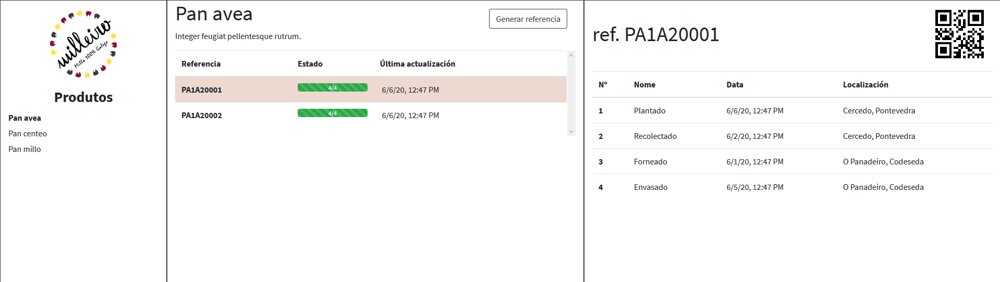
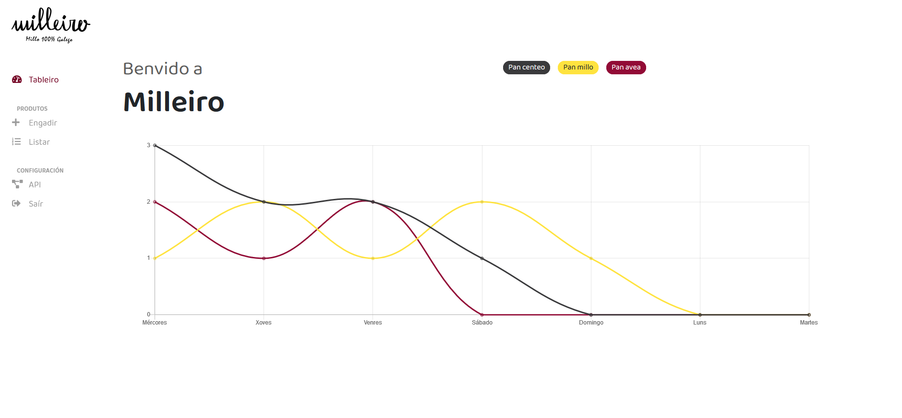

# milleiro

A full web/android app with backend, to track the traceability of specific products.

## android-add-app
Android demo app to insert new data from a reference.

## backend
frontend-admin associated backend

## backend-add-app
android-add-app associated backend

## backend-manage
frontend-manage associated backend

## design
Design images

## docker
Dockerfiles to deploy the software.

## frontend-admin
Web app basic 

## frontend-manage
Web app advanced

## milleiroapp
Android milleiro app - Final user

## milleiroapp-backend
Backend for milleiroapp

## sql
SQL database schema and demo data